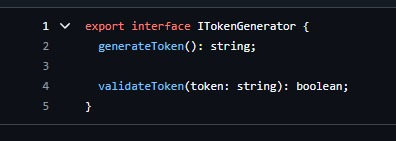
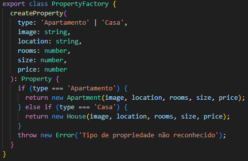

# 3.1. Módulo Padrões de Projeto GoFs Criacionais

## Introdução

Os **padrões criacionais** são uma categoria de padrões de projeto que se concentram na forma como os objetos são criados. Eles oferecem soluções que permitem instanciar objetos de maneira mais flexível e controlada, ocultando a lógica de criação e promovendo a reutilização do código. Essa abordagem é fundamental em projetos de software, pois facilita a manutenção e a escalabilidade, além de permitir que os desenvolvedores adaptem facilmente o código às necessidades específicas do projeto.

## Metodologia

A metodologia para implementar padrões criacionais envolve as seguintes etapas:

1. **Identificação da Necessidade**: reconhecer a necessidade de um padrão criacional em um contexto específico do projeto. Isso pode ocorrer quando se busca uma maneira eficiente de instanciar objetos ou quando há complexidade na criação de objetos.

2. **Escolha do Padrão**: selecionar o padrão criacional mais adequado com base nas características do problema. Por exemplo:

   - **Singleton**: quando é necessário garantir que uma classe tenha apenas uma instância.
   - **Factory Method**: quando se deseja delegar a criação de objetos para subclasses.
   - **Abstract Factory**: quando é necessário criar famílias de objetos relacionados sem especificar suas classes concretas.
   - **Builder**: quando a construção de um objeto complexo deve ser separada da sua representação.
   - **Prototype**: Quando se deseja criar novos objetos duplicando um objeto existente.

3. **Implementação**: aplicar o padrão escolhido no código, garantindo que a lógica de criação esteja encapsulada conforme as diretrizes do padrão.

4. **Testes e Validação**: realizar testes para assegurar que a implementação do padrão atende aos requisitos funcionais e não funcionais do sistema.

5. **Documentação**: documentar a aplicação do padrão, incluindo exemplos e justificativas para sua escolha, facilitando a compreensão para outros desenvolvedores que possam trabalhar no projeto futuramente.

Essa abordagem sistemática permite que os padrões criacionais sejam utilizados de maneira eficaz, aumentando a flexibilidade e a manutenibilidade do software.

# Factory Method

O padrão de projeto Factory Method foi utilizado para encapsular a lógica de criação de um objeto User com base nos dados recebidos no CreateUserDto. Esse padrão é útil porque centraliza a criação de objetos, promovendo reuso, padronização e organização do código.

A seguir tem a imagens da implementação:

<center>


</center>

<figcaption align='center'>
    <h6><b>Figura 1: Classe UserFactory. Autor(es): Gabriel Marcolino e Shaíne Oliveira</h6></b>
</figcaption>

Lógica de criação de um token com base no tipo de criptografia. Esse padrão é útil porque centraliza a criação de objetos, promovendo reuso, padronização e organização do código.

A seguir tem a imagens da implementação:

<center>



</center>

<figcaption align='center'>
    <h6><b>Figura 2: Classe UserFactory. Autor(es): Caio Berg</h6></b>
</figcaption>

```typescript
export class ListingFormFactory {
  static createForm(fb: FormBuilder): FormGroup {
    return fb.group({
      userCpfCnpj: ['123456789'],
      propertyType: ['', Validators.required],
      numberOfBedrooms: [null, Validators.required],
      numberOfBathrooms: [null, Validators.required],
      parkingSpaces: [null],
      address: fb.group({
        postalCode: ['', Validators.required],
        street: ['', Validators.required],
        neighborhood: ['', Validators.required],
        number: ['', Validators.required],
        city: ['', Validators.required],
        state: ['', Validators.required],
        logradouro: [''],
      }),
      titulo: ['', Validators.required],
      adType: ['', Validators.required],
      price: [null],
      condoFee: [null],
      propertyTax: [null],
      description: ['', Validators.required],
    });
  }
}
```
<figcaption align='center'>
    <h6><b>Uso na Classe ListingFormFactory. Autor(es): Thiago Freitas</h6></b>
</figcaption>

```typescript
export class ProfileFormFactory {
  static createForm(fb: FormBuilder): FormGroup {
    return fb.group({
      name: ['', Validators.required],
      email: ['', Validators.required],
      password: ['', Validators.required],
      confirmPassword: ['', Validators.required],
      site: ['', Validators.required],
      phone: ['', Validators.required],
    });
  }
}
```
<figcaption align='center'>
    <h6><b>Uso na Classe ProfileFormFactory. Autor(es): Thiago Freitas</h6></b>
</figcaption>


Lógica de programação que permite que no futuro outrso tipos de propriedade sejam adicionados, basta criar uma nova classe e ajustá-la na PropertyFactory.

A seguir tem a imagens da implementação na página inicial do site:

<center>



</center>

<figcaption align='center'>
    <h6><b>Figura 5: Classe PropertyFactory. Autor(es): Ester Lino</h6></b>
</figcaption>

# Builder

O padrão **Builder** permite a construção de objetos complexos passo a passo. Ele foi utilizado no método `updateUser` para construir o objeto `UpdateUserDto` e no `deleteUser` para construir a resposta da requisição.

## Rastreabilidade e Elos com Outros Artefatos

- **Camada de Serviço**: Usa o objeto configurado pelo Builder para a lógica de negócio.
- **Camada de Repositório**: Recebe o objeto `UpdateUserDto` construído pelo Builder para enviar ao banco.

## Implementação

### Classe Builder:

```typescript
export class UserResponseDtoBuilder {
  private data: UserResponseDto;

  constructor() {
    this.data = new UserResponseDto();
  }

  setName(name: string): UserResponseDtoBuilder {
    this.data.name = name;
    return this;
  }

  setCpfCnpj(cpf_cnpj: string): UserResponseDtoBuilder {
    this.data.cpf_cnpj = cpf_cnpj;
    return this;
  }

  setEmail(email: string): UserResponseDtoBuilder {
    this.data.email = email;
    return this;
  }

  setSite(site: string): UserResponseDtoBuilder {
    this.data.site = site;
    return this;
  }

  build(): UserResponseDto {
    return this.data;
  }
}
```

### Uso no Método `updateUser`:

```typescript
const builder = new UpdateUserBuilder();
const userResponse = builder
  .setName(data.name)
  .setCpfCnpj(data.cpf_cnpj)
  .setEmail(data.email)
  .setSite(data.site)
  .build();
```

### Uso no Método `deleteUser`:

```typescript
const builder = new UserResponseDtoBuilder();
const userResponse = builder
  .setName(deletedUser.name)
  .setCpfCnpj(deletedUser.cpf_cnpj)
  .setEmail(deletedUser.email)
  .setSite(deletedUser.site)
  .build();
```

## Senso Crítico

### Por que Builder?

- Evita que a lógica de configuração de objetos fique espalhada no código.

### Pontos Positivos:

- Facilita a adição de novos campos sem alterar o método principal.

### Limitações:

- Requer mais esforço inicial para configurar o Builder.

# Singleton

O padrão **Singleton** foi utilizado para garantir que apenas uma instância da classe `ApiService` seja criada e compartilhada entre os componentes que a utilizam. Isso é util para padronizar o acesso a recursos compartilhados e evitar problemas de concorrência.

## Implementação 1

## Rastreabilidade e Elos com Outros Artefatos

- **Camada de Serviço**: Usa a instância única de `ApiService` para fazer requisições HTTP.
- **Camada de Repositório**: Recebe os dados obtidos pela `ApiService` para persistir no banco.

### Classe Singleton:

```typescript
export class ApiService {
  constructor(private http: HttpClient) {}

  httpOptions(contentType = 'application/json', hasContentType = true): any {
    if (hasContentType) {
      return {
        headers: new HttpHeaders({
          'Content-Type': contentType,
        }),
      };
    }
    return undefined;
  }

  get<T = any>(controller: string): Observable<T> {
    return this.http
      .get<T>(`${APP_API}/${controller}`, {
        ...this.httpOptions,
      })
      .pipe(map((res) => res));
  }

  ...
}
```

### Uso no Método `getAllImoveis`:

```typescript
    constructor(private apiService: ApiService) {}

    getAllImoveis() {
      return this.apiService.get(`/imovel`);
    }

    ...
```

---

## Implementação 2

O padrão **Singleton** foi utilizado na classe `TokenManager` para garantir que apenas uma instância da classe seja criada e compartilhada durante todo o ciclo de vida da aplicação. Isso é útil para padronizar o acesso ao gerenciamento de tokens e evitar a criação de múltiplas instâncias que possam consumir recursos desnecessários.

## Rastreabilidade e Elos com Outros Artefatos

- **Camada de Serviço**: A instância única de `TokenManager` é injetada nos serviços para gerar e verificar tokens de autenticação.

- **Camada de Autenticação**: Utiliza o `TokenManager` para validar e gerar tokens JWT, centralizando a lógica de autenticação.

### Classe Singleton:

```typescript
import { Injectable } from "@nestjs/common";
import * as jwt from "jsonwebtoken";
@Injectable()
export class TokenManager {
  private readonly secret = "asdasdasd123123";
  generateToken(payload: any): string {
    return jwt.sign(payload, this.secret, { expiresIn: "1h" });
  }
  verifyToken(token: string): any {
    try {
      return jwt.verify(token, this.secret);
    } catch (error) {
      throw new Error("Invalid token");
    }
  }
}
```

### Uso no Método `login`:

```typescript
import { Injectable } from "@nestjs/common";
import { PasswordAuthStrategy } from "./strategies/password.auth.strategy";
import { TokenManager } from "./token.manager";
import { UnauthorizedException } from "@nestjs/common";
@Injectable()
export class PasswordAuth {
  constructor(
    private readonly strategy: PasswordAuthStrategy,
    private readonly tokenManager: TokenManager
  ) {}
  async login(email: string, password: string): Promise<any> {
    const user = await this.strategy.authenticate(email, password);

    if (!user) {
      throw new UnauthorizedException("Invalid credentials");
    }

    return this.tokenManager.generateToken({ id: user.id, email: user.email });
  }
}
```
## Implementação 3

O padrão **Singleton** também foi implementado na classe `AnunciosService` para garantir que apenas uma única instância desse serviço seja criada e compartilhada em toda a aplicação. Isso assegura um gerenciamento centralizado dos anúncios, evitando inconsistências e redundâncias.

## **Rastreabilidade e Elos com Outros Artefatos**

- **Camada de Serviço**: A instância única de `AnunciosService` é injetada no `AnunciosFacadeService` para gerenciar operações relacionadas aos anúncios, como listar, atualizar, pausar e excluir.

- **Camada de Facade**: O `AnunciosFacadeService` utiliza o `AnunciosService` e outros serviços como `AnuncioAdapterService` para fornecer uma interface simplificada para os componentes consumirem as funcionalidades dos anúncios.

- **Componentes de Interface**: Componentes como `MeusAnunciosComponent` e `EditarAnuncioComponent` interagem com o `AnunciosFacadeService` para realizar operações nos anúncios, garantindo que todas as interações passem pelo facade e mantenham a consistência do estado.


### **Classe Singleton: AnunciosService**

```typescript
import { Injectable } from '@angular/core';
import { ImovelInterface, TipoAnuncioEnum, TipoImovelEnum } from '../interfaces/imovel.interface';
import { Observable, of } from 'rxjs';

@Injectable({
  providedIn: 'root' // Garante que seja um Singleton
})
export class AnunciosService {
  private anuncios: ImovelInterface[] = [...];

  listarAnuncios(): Observable<ImovelInterface[]> {
    return of(this.anuncios);
  }

  obterAnuncioPorId(id: number): Observable<ImovelInterface | undefined> {
    const anuncio = this.anuncios.find(a => a.id === id);
    return of(anuncio);
  }

  atualizarAnuncio(id: number, dados: Partial<ImovelInterface>): Observable<boolean> {
    const index = this.anuncios.findIndex(a => a.id === id);
    if (index !== -1) {
      this.anuncios[index] = { ...this.anuncios[index], ...dados };
      return of(true);
    }
    return of(false);
  }

  excluirAnuncio(id: number): Observable<boolean> {
    const index = this.anuncios.findIndex(a => a.id === id);
    if (index !== -1) {
      this.anuncios.splice(index, 1);
      return of(true);
    }
    return of(false);
  }
}
```


### Uso na listagem de imóveis cadastrados

---

## Senso Crítico

### Por que Singleton?

- Garante que apenas uma instância de `ApiService` seja criada e compartilhada.

### Pontos positivos:

- Padroniza o acesso a recursos compartilhados.
- Evita problemas de concorrência.

### Limitações:

- Requer mais esforço inicial para configurar o Singleton.

# Prototype

O padrão **Prototype** foi utilizado no processo de edição de uma propriedade para criar um clone do objeto antes de aplicar as alterações. Esse padrão foi escolhido para preservar os dados originais da propriedade enquanto as alterações estão sendo processadas. Isso garante que o estado atual não seja comprometido caso ocorra algum erro.

## **Rastreabilidade e Elos com Outros Artefatos**

- **Camada de Serviço**: Usa o Prototype para clonar o objeto antes de realizar alterações.
- **Camada de Repositório**: Recebe os dados atualizados do clone e os salva no banco de dados.

## **Implementação**

### **Classe Prototype**

```typescript
export class PropertyPrototype {
  id: number;
  adType: string;
  condoFee: number;
  description: string;
  propertyTax: number;
  available: boolean;
  numberOfBedrooms: number;
  price: number;
  parkingSpaces: number;
  propertyType: string;
  numberOfBathrooms: number;
  userCpfCnpj: string;
  status: string;
  address: {
    neighborhood: string;
    number: string;
    street: string;
    city: string;
    state: string;
    postalCode: string;
  };

  clone(): PropertyPrototype {
    return Object.assign(new PropertyPrototype(), this);
  }
}
```

### **Uso no Serviço**

```typescript
async updateProperty(id: number, data: CreatePropertyDto) {
  const property = await this.repository.findPropertyById(id);

  if (!property) {
    throw new NotFoundException(`Propriedade com ID ${id} não encontrada.`);
  }

  const propertyPrototype = Object.assign(new PropertyPrototype(), property);
  const clonedProperty = propertyPrototype.clone();

  Object.assign(clonedProperty, data);

  return this.repository.updateProperty(id, clonedProperty);
}
```

### **Uso do Prototype na Tela de Cadastro**

```typescript
export class FormPrototype implements FormModel {
  name: string;
  cpf_cnpj: string;
  email: string;
  password: string;
  site: string;
  confirmPassword: string;

  clone(): FormPrototype {
    return new FormPrototype({
      name: this.name,
      cpf_cnpj: this.cpf_cnpj,
      email: this.email,
      password: this.password,
      site: this.site,
      confirmPassword: this.confirmPassword,
    });
  }
}
```

## **Senso Crítico**

### Por que Prototype?

- Permite clonar objetos complexos de forma eficiente.
- Garante que o estado original do objeto seja preservado.

### Pontos Positivos:

- Segurança ao manipular dados sensíveis.
- Simplifica o processo de teste e validação antes de salvar alterações.

### Limitações:

- Requer esforço adicional para configurar a classe Prototype.

# Bibliografia

1. Refactoring Guru. Disponível em: <https://refactoring.guru/pt-br>. Ultimo acesso em: 3 de janeiro de 2025.
2. DIO. Introdução aos Design Patterns em Java. Disponível em: https://www.dio.me/articles/introducao-aos-design-patterns-em-java. Acesso em: 06 jan. 2025.
3. Refactoring.Guru. Padrões de Projeto. Disponível em: https://refactoring.guru/pt-br/design-patterns. Acesso em: 06 jan. 2025.
4. GRAN CURSOS ONLINE. Padrões de Projetos GoF: Padrões de Criação. Disponível em: https://blog.grancursosonline.com.br/padroes-de-projetos-gof-padroes-de-criacao/. Acesso em: 06 jan. 2025.

# Histórico de Versão

| Versão |    Data    |                              Descrição                               |                                                 Autor(es)                                                  |
| :----: | :--------: | :------------------------------------------------------------------: | :--------------------------------------------------------------------------------------------------------: |
| `1.0`  | 02/01/2025 |                Adicionando padrão de projeto Factory                 | [Gabriel Marcolino](https://github.com/GabrielMR360), [Shaíne Oliveira](https://github.com/ShaineOliveira) |
| `2.0`  | 04/01/2025 |            Implementação e documentação do Padrão Builder            |    [Arthur Gabriel](https://github.com/ArthurGabrieel), [Miguel Moreira](https://github.com/EhOMiguel)     |
| `2.1`  | 04/01/2025 |                 Adaptação do desing pattern builder                  |    [Arthur Gabriel](https://github.com/ArthurGabrieel), [Miguel Moreira](https://github.com/EhOMiguel)     |
| `3.0`  | 04/01/2025 |           Implementação e documentação do Padrão Singleton           |          [Lucas Macedo](https://github.com/Luckx98), [Ester Lino](https://github.com/esteerlino)           |
| `3.1`  | 05/01/2025 |        Adição do método deleteUser ao design pattern builder         |                                [Pedro Sena](https://github.com/pedroyen21)                                 |
| `3.2`  | 06/01/2025 |       Adição do método verifyToken ao design pattern Singleton       |       [Pedro Izarias](https://github.com/Izarias), [Gabriel Bertolazi](https://github.com/Bertolazi)       |
| `4.0`  | 06/01/2025 |           Implementação e documentação do Padrão Prototype           |                               [Miguel Moreira](https://github.com/EhOMiguel)                               |
| `5.0`  | 06/01/2025 |            Implementação e documentação do Padrão Factory            |                                [Caio Berg](https://github.com/Caio-bergbjj)                                |
| `5.1`  | 06/01/2025 |           Inclui informações sobre os Padrões Criacionais            |                                [Ester Lino](https://github.com/esteerlino)                                 |
| `5.2`  | 06/01/2025 | Implementação e documentação do Padrão Prototype na tela de cadastro |          [Ester Lino](https://github.com/esteerlino), [Lucas Macedo](https://github.com/Luckx98)           |
| `5.3`  | 06/01/2025 |    Implementação e documentação do Padrão Factory na tela inicial    |                                [Ester Lino](https://github.com/esteerlino)                                 |
| `5.4`  | 06/01/2025 |    Adição da classe AnunciosService ao design pattern Singleton    |                                [Arthur Trindade](https://github.com/trindadea) 
