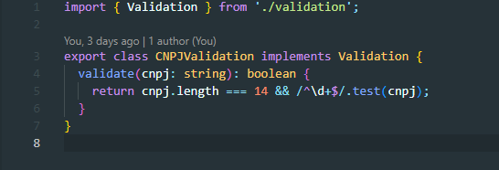

# 3.3. Módulo Padrões de Projeto GoFs Comportamentais

## Introdução

Os **padrões comportamentais** são uma categoria de padrões de projeto que se concentram na interação e na responsabilidade entre objetos. Eles definem como os objetos se comunicam e colaboram, promovendo uma estrutura clara para a divisão de responsabilidades e a flexibilidade nas interações. Ao utilizar padrões comportamentais, os desenvolvedores podem criar sistemas que são mais fáceis de entender e modificar, uma vez que esses padrões ajudam a evitar o acoplamento excessivo entre os componentes do sistema.

## Metodologia

A metodologia para implementar padrões comportamentais envolve as seguintes etapas:

1. **Identificação do Problema**: reconhecer a necessidade de um padrão comportamental em um contexto específico do projeto. Isso pode ocorrer quando há complexidade nas interações entre objetos ou quando se busca uma maneira eficiente de delegar responsabilidades.

2. **Escolha do Padrão**: selecionar o padrão comportamental mais adequado com base nas características do problema. Por exemplo:
   - **Observer**: para permitir que um objeto notifique outros objetos sobre mudanças em seu estado.
   - **Strategy**: para definir uma família de algoritmos, encapsulá-los e torná-los intercambiáveis.
   - **Command**: para encapsular uma solicitação como um objeto, permitindo parametrizar clientes com diferentes solicitações.
   - **State**: para permitir que um objeto altere seu comportamento quando seu estado interno muda.
   - **Chain of Responsibility**: para passar a solicitação ao longo da cadeia de manipuladores até que um deles trate a solicitação.

3. **Implementação**: aplicar o padrão escolhido no código, garantindo que a lógica de interação esteja bem definida conforme as diretrizes do padrão.

4. **Testes e Validação**: realizar testes para assegurar que a implementação do padrão atende aos requisitos funcionais e não funcionais do sistema.

5. **Documentação**: documentar a aplicação do padrão, incluindo exemplos e justificativas para sua escolha, facilitando a compreensão para outros desenvolvedores que possam trabalhar no projeto futuramente.

Essa abordagem sistemática permite que os padrões comportamentais sejam utilizados de maneira eficaz, aumentando a flexibilidade e a manutenibilidade do software.

## Strategy

### 1. Funcionalidade: Cadastro de Usuário

O padrão de projeto **Strategy** foi implementado junto da funcionalidade de **cadastro de usuário** para encapsular as diferentes validações. Assim, é possível que o comportamento de um objeto seja alterado dinamicamente, sem mudar o código que usa o objeto.

### Aplicação:

- **Interface Validation:** Define o contrato comum para todas as validações.
- **Classes CNPJValidation e CPFValidation:** Implementam a interface Validation com as validações específicas para CNPJ e CPF.
- **Classe ValidationService:** Possui um atributo strategy, que armazena a estratégia de validação. A estratégia pode ser trocada dinamicamente através do método `setStrategy`.

### Imagens da Implementação:

<center>

   
</center>

<figcaption align='center'>
    <h6><b>Figura 1: Interface Validation. Autor(es): Gabriel Marcolino e Shaíne Oliveira</h6></b>
</figcaption>

<center>

   
</center>
<figcaption align='center'>
    <h6><b>Figura 2: Classe CNPJValidation. Autor(es): Gabriel Marcolino e Shaíne Oliveira</h6></b>
</figcaption>

<center>

   
</center>
<figcaption align='center'>
    <h6><b>Figura 3: Classe CPFValidation. Autor(es): Gabriel Marcolino e Shaíne Oliveira</h6></b>
</figcaption>

<center>


</center>
<figcaption align='center'>
    <h6><b>Figura 4: Classe ValidationService. Autor(es): Gabriel Marcolino e Shaíne Oliveira</h6></b>
</figcaption>

---

### 2. Funcionalidade: Atualização de Usuários

Nesta funcionalidade, o padrão **Strategy** foi implementado no método `updateUser` para encapsular e validar os CPFs antes de atualizar os dados de um usuário no banco.

#### Fragmentos de Código:

1. **Interface UpdateStrategy:**
```typescript
   export interface UpdateStrategy {
  execute(data: any): any;
}
```


2. **Classe CPFValidationStrategy:**
```typescript
export class CPFValidationStrategy implements UpdateStrategy {
  execute(cpf: string): boolean {
    if (!cpf || cpf.length !== 11) {
      throw new Error('CPF inválido');
    }
    return true;
  }
}
```


3. **Uso no Método updateUser:**

```typescript
   const validationStrategy: UpdateStrategy = new CPFValidationStrategy();
    validationStrategy.execute(cpf_cnpj);
```
---
### 3. Funcionalidade: Autenticação com Senha
Nesta funcionalidade, o padrão **Strategy** foi implementado na classe `PasswordAuthStrategy`, que encapsula a lógica de autenticação por senha. A classe permite que a estratégia de autenticação seja trocada de maneira flexível, sem modificar a estrutura principal de autenticação.

#### Fragmentos de Código

1. **Classe PasswordAuthStrategy:**

```typescript
import { Injectable } from '@nestjs/common';
import { UserRepository } from 'src/user/user.repository';
import * as bcrypt from 'bcrypt';
@Injectable()
export class PasswordAuthStrategy {
  constructor(private readonly userRepository: UserRepository) {}
  async authenticate(email: string, password: string): Promise<any> {
    const user = await this.userRepository.findByEmail(email);
    if (!user) {
      return null; 
    }

    const isPasswordValid = await bcrypt.compare(password, user.password);
    return isPasswordValid ? user : null; 
  }
}
```

2. **Uso na Classe PasswordAuth:**

```typescript
import { Injectable } from "@nestjs/common";
import { PasswordAuthStrategy } from "./strategies/password.auth.strategy";
import { TokenManager } from "./token.manager";
import { UnauthorizedException } from "@nestjs/common"; 
@Injectable()
export class PasswordAuth {
  constructor(
    private readonly strategy: PasswordAuthStrategy,
    private readonly tokenManager: TokenManager,
  ) {}
  async login(email: string, password: string): Promise<any> {
    const user = await this.strategy.authenticate(email, password);
    
    if (!user) {
      throw new UnauthorizedException('Invalid credentials'); 
    }
    
    return this.tokenManager.generateToken({ id: user.id, email: user.email });
  }
}
```

### 4. Funcionalidade: Reset de senha

O padrão **Strategy** foi aplicado para permitir a **flexibilidade** na geração e validação de tokens de reset de senha, utilizando diferentes algoritmos (como **UUID** ou **JWT**) sem que o restante do sistema precise conhecer ou se acoplar às implementações específicas.

### Rastreabilidade e Elos com Outros Artefatos
- **ITokenGenerator**: Define a interface genérica para geração e validação de tokens.  
- **UuidTokenGenerator** e **JwtTokenGenerator**: Implementam a interface `ITokenGenerator`, fornecendo estratégias distintas para criação e validação de tokens.  
- **TokenGeneratorFactory**: Utiliza o padrão **Factory Method** para decidir qual estratégia (`UuidTokenGenerator` ou `JwtTokenGenerator`) será instanciada.  
- **PasswordResetFacade**: Consome a `ITokenGenerator` para gerar e validar tokens, sem se preocupar com a implementação concreta.

---

### Implementação

#### Interface `ITokenGenerator`
```typescript
export interface ITokenGenerator {
  generateToken(): string;
  validateToken(token: string): boolean;
}
```

A interface `ITokenGenerator` define os métodos que todas as implementações devem possuir:

- `generateToken()`: Cria um token para ser usado no reset de senha.
- `validateToken(token: string)`: Verifica se o token é válido.

---

#### Estratégia 1: `UuidTokenGenerator`
```typescript
import { ITokenGenerator } from './ITokenGenerator';
import { v4 as uuidv4 } from 'uuid';

export class UuidTokenGenerator implements ITokenGenerator {
  generateToken(): string {
    return uuidv4(); // Gera um UUID
  }

  validateToken(token: string): boolean {
    const uuidRegex = /^[0-9a-f]{8}-[0-9a-f]{4}-[0-9a-f]{4}-[0-9a-f]{4}-[0-9a-f]{12}$/i;
    return uuidRegex.test(token); // Verifica se o token segue o padrão UUID
  }
}
```

---

#### Estratégia 2: `JwtTokenGenerator`

```typescript
import { ITokenGenerator } from './ITokenGenerator';
import jwt from 'jsonwebtoken';

const SECRET_KEY = 'SUA_CHAVE_SECRETA';

export class JwtTokenGenerator implements ITokenGenerator {
  generateToken(): string {
    return jwt.sign({ resetPassword: true }, SECRET_KEY, { expiresIn: '1h' }); // Gera um JWT com expiração de 1h
  }

  validateToken(token: string): boolean {
    try {
      jwt.verify(token, SECRET_KEY); // Verifica o JWT com a chave secreta
      return true;
    } catch {
      return false;
    }
  }
}
```

#### Estretágia 3: `JwtStrategy`

```typescript
@Injectable()
export class JwtStrategy extends PassportStrategy(Strategy) {
  constructor(private tokenManager: TokenManager) {
    super({
      jwtFromRequest: ExtractJwt.fromAuthHeaderAsBearerToken(),
      ignoreExpiration: false,
      secretOrKey: 'asdsadkjnaskdjaskdnasdkjn123',
    });
  }

  async validate(payload: any) {
    return { userId: payload.id, email: payload.email };
  }
}
```

---

#### Uso na Fábrica: `TokenGeneratorFactory`

A fábrica (`TokenGeneratorFactory`) é responsável por instanciar a estratégia correta conforme o tipo de token desejado.

```typescript
export enum TokenType {
  UUID = 'uuid',
  JWT = 'jwt',
}

export class TokenGeneratorFactory {
  public static createTokenGenerator(type: TokenType): ITokenGenerator {
    switch (type) {
      case TokenType.UUID:
        return new UuidTokenGenerator();
      case TokenType.JWT:
        return new JwtTokenGenerator();
      default:
        throw new Error(`Tipo de token não suportado: ${type}`);
    }
  }
}
```

---

#### Uso no Facade: `PasswordResetFacade`

O **Facade** utiliza a interface `ITokenGenerator` para interagir com as estratégias (`UuidTokenGenerator` ou `JwtTokenGenerator`) sem depender diretamente das implementações.

```typescript
import { Injectable } from '@nestjs/common';
import { TokenGeneratorFactory, TokenType } from '../factories/token-generator.factory';

@Injectable()
export class PasswordResetFacade {
  public async sendResetLink(email: string): Promise<void> {
    // Usa a fábrica para criar a estratégia desejada
    const tokenGenerator = TokenGeneratorFactory.createTokenGenerator(TokenType.UUID);
    const token = tokenGenerator.generateToken();
    console.log(`[SIMULAÇÃO] Token gerado: ${token}`);
  }

  public async resetPassword(token: string): Promise<void> {
    const tokenGenerator = TokenGeneratorFactory.createTokenGenerator(TokenType.UUID);
    if (!tokenGenerator.validateToken(token)) {
      throw new Error('Token inválido');
    }
    console.log(`[SIMULAÇÃO] Token validado com sucesso.`);
  }
}
```

---

### Rastreabilidade

- **Interface**: `ITokenGenerator` é a abstração genérica que define o contrato para as implementações de geração/validação de tokens.  
- **Classes concretas**:  
  - `UuidTokenGenerator`: Implementa a estratégia de geração/validação baseada em UUID.  
  - `JwtTokenGenerator`: Implementa a estratégia de geração/validação baseada em JWT.  
- **Fábrica**: `TokenGeneratorFactory` é responsável por fornecer a instância correta de `ITokenGenerator`.  
- **Facade**: O `PasswordResetFacade` utiliza a interface para orquestrar o fluxo de recuperação de senha.

---

### Senso Crítico

#### Por que Strategy?

- Permite encapsular e alternar diferentes lógicas de validação de documentos.

#### Pontos Positivos:

- **Extensível:** Facilita a adição de novas estratégias, como CNPJ.
- **Modularidade:** Mantém o método principal limpo e focado.

#### Limitações:

- Adiciona complexidade desnecessária em cenários simples, com apenas uma estratégia.


## Template

#### 1. Funcionalidade: Detalhar propriedade

O padrão **Template** foi aplicado para adicionar praticidade à busca de propriedades.

### Rastreabilidade e Elos com Outros Artefatos

- **FindProperty**: É o Template. Implementa o método imutável e declara os métodos abstratos de validação da entrada e formatação da saída.
- **FindOneProperty**: Extende FindProperty e implementa os métodos abstratos da classe mãe. 
- **PropertyService**: Utiliza o FindOneProperty para fazer a busca de imóveis.

### Implementação
#### Classe FindProperty:

```typescript
export abstract class FindProperty<I, O> {
  async getObject(data: I): Promise<O> {
    this.validateObject(data);

    const property = await this.fetchObject(data);

    return this.formatResponse(property);
  }

  protected abstract validateObject(data: I): void;

  protected abstract fetchObject(data: I): Promise<Property | Property[]>;

  protected abstract formatResponse(property: Property | Property[]): O;
}

```


#### Classe FindOneProperty:

```typescript
export class FindOneProperty extends FindProperty<number, PropertyDetailsDto> {
  constructor(private readonly repository: PropertyRepository) {
    super();
  }

  protected validateObject(id: number): void {
    if (!id || id < 1) {
      throw new Error('ID is required and must be valid.');
    }
  }

  protected async fetchObject(id: number): Promise<Property> {
    return this.repository.findPropertyById(id);
  }

  protected formatResponse(property: Property): PropertyDetailsDto {
    return {
      ...property,
    };
  }
}
```

#### Uso no método findOne da classe PropertyService:

```typescript
  async findOne(id: number) {
    const finder = new FindOneProperty(this.repository);
    return finder.getObject(id);
    }
```

#### 2. Funcionalidade: Criar Anúncio

O padrão **Template** foi aplicado para adicionar praticidade à criação de propriedades.

### Rastreabilidade e Elos com Outros Artefatos

- **FindProperty**: É o Template. Define o fluxo imutável do algoritmo e declara os métodos abstratos que as subclasses devem implementar (validação da entrada, busca de dados e formatação da saída).  
- **FindResidentialProperty**: Extende `FindProperty` e implementa os métodos abstratos específicos para propriedades residenciais.  
- **FindCommercialProperty**: Extende `FindProperty` e implementa os métodos abstratos específicos para propriedades comerciais.  
- **PropertyService**: Utiliza as subclasses (`FindResidentialProperty`, `FindCommercialProperty`) para buscar e formatar os dados conforme o tipo de propriedade.

---

### Implementação

#### Classe FindProperty:

```typescript
export abstract class FindProperty<I, O> {
  async getObject(data: I): Promise<O> {
    this.validateObject(data);

    const property = await this.fetchObject(data);

    return this.formatResponse(property);
  }

  protected abstract validateObject(data: I): void;

  protected abstract fetchObject(data: I): Promise<Property | Property[]>;

  protected abstract formatResponse(property: Property | Property[]): O;
}
```

---

#### Classe FindResidentialProperty:

```typescript
import { Property } from '@prisma/client';
import { FindProperty } from './FindProperty';

export class FindResidentialProperty extends FindProperty<number, any> {
  protected validateObject(data: number): void {
    if (typeof data !== 'number' || data <= 0) {
      throw new Error('ID inválido para propriedade residencial');
    }
  }

  protected async fetchObject(data: number): Promise<Property> {
    // Simula a busca no banco (exemplo fictício)
    return await prisma.property.findUnique({
      where: { id: data, type: 'residential' },
    });
  }

  protected formatResponse(property: Property): any {
    return {
      id: property.id,
      name: property.name,
      type: property.type,
    };
  }
}
```

---

#### Classe FindCommercialProperty:

```typescript
import { Property } from '@prisma/client';
import { FindProperty } from './FindProperty';

export class FindCommercialProperty extends FindProperty<number, any> {
  protected validateObject(data: number): void {
    if (typeof data !== 'number' || data <= 0) {
      throw new Error('ID inválido para propriedade comercial');
    }
  }

  protected async fetchObject(data: number): Promise<Property> {
    // Simula a busca no banco (exemplo fictício)
    return await prisma.property.findUnique({
      where: { id: data, type: 'commercial' },
    });
  }

  protected formatResponse(property: Property): any {
    return {
      id: property.id,
      name: property.name,
      type: property.type,
      commercialDetails: 'Detalhes específicos de propriedades comerciais',
    };
  }
}
```

---

#### Uso no método findProperty da classe PropertyService:

```typescript
import { FindResidentialProperty } from './FindResidentialProperty';
import { FindCommercialProperty } from './FindCommercialProperty';

export class PropertyService {
  async findProperty(id: number, type: string) {
    let finder;

    if (type === 'residential') {
      finder = new FindResidentialProperty();
    } else if (type === 'commercial') {
      finder = new FindCommercialProperty();
    } else {
      throw new Error('Tipo de propriedade inválido.');
    }

    return finder.getObject(id);
  }
}
```

---

### Explicação

- **FindProperty** define o fluxo geral: validação dos dados, busca no banco e formatação da resposta.
- As subclasses (`FindResidentialProperty`, `FindCommercialProperty`) personalizam a lógica para tipos específicos de propriedades.
- O **PropertyService** instancia a subclasse correta com base no tipo de propriedade, mantendo o código extensível e organizado.

### Senso Crítico
#### Por que Template?

- Define etapas padrões para todas as buscas de propriedades. 

#### Pontos Positivos:

- Padroniza a estrutura do código, reduzindo possíveis erros.
- Torna o código principal mais limpo e conciso.
- É flexível, permite que um método específico seja sobrescrito de acordo com a necessidade.

#### Limitações:

- Não permite que os métodos já implementados no template sejam alterados.
- Rígido para alterações futuras

## State

O padrão **State** foi utilizado para gerenciar os estados de uma propriedade, como `PUBLISHED` e `PAUSED`. Isso permite encapsular a lógica de transição entre estados e garantir que ações só sejam executadas em estados válidos.

### **Rastreabilidade e Elos com Outros Artefatos**

- **Camada de Serviço**: Usa o contexto do estado para gerenciar transições.
- **Camada de Repositório**: Persiste as mudanças de estado no banco de dados.

### **Implementação**

#### **Interface State**

```typescript
export interface PropertyState {
  pause(): PropertyState;
}

```

#### **Classes de Estado**

```typescript
export class PublishedState implements PropertyState {
  pause(): PropertyState {
    return new PausedState();
  }
}

export class PausedState implements PropertyState {
  pause(): PropertyState {
    throw new Error('O anúncio já está pausado.');
  }
}

```

#### **Contexto**

```typescript
export class PropertyContext {
  private state: PropertyState;

  constructor(state: PropertyState) {
    this.state = state;
  }

  setState(state: PropertyState): void {
    this.state = state;
  }

  pause(): void {
    this.state = this.state.pause();
  }
}

```

#### **Uso no Serviço**

```typescript
async pauseProperty(id: number): Promise<{ id: number; status: string }> {
  const property = await this.repository.findPropertyById(id);

  if (!property) {
    throw new NotFoundException(`Propriedade com ID ${id} não encontrada.`);
  }

  let stateContext: PropertyContext;

  if (property.status === 'PUBLISHED') {
    stateContext = new PropertyContext(new PublishedState());
  } else if (property.status === 'PAUSED') {
    stateContext = new PropertyContext(new PausedState());
  } else {
    throw new Error(`Estado inválido: ${property.status}`);
  }

  stateContext.pause();
  await this.repository.updatePropertyStatus(id, 'PAUSED');

  return { id, status: 'PAUSED' };
}

```

### **Senso Crítico**

#### Por que State?

- Simplifica a lógica de gerenciamento de estados.
- Encapsula comportamentos específicos de cada estado.

#### Pontos Positivos:

- Adapta-se facilmente a novos estados.
- Modularidade e manutenção simplificada.

#### Limitações:

- Pode adicionar complexidade se muitos estados forem usados.

---

## Observer

### 1. Funcionalidade: Notificação de Alterações de Propriedade

O padrão de projeto **Observer** foi implementado para notificar automaticamente os interessados sobre alterações nas propriedades. Isso permite que múltiplos objetos sejam informados e atualizados quando o estado de um objeto observado muda.

### Uso no Profile Component

```typescript
ngOnInit(): void {
  this.profileForm = ProfileFormFactory.createForm(this.fb);
  this.apiService.get('users/123456789').subscribe(
    (response) => {
      const adaptedData = UserAdapter.adapt(response);
      this.profileForm.patchValue(adaptedData);
    },
    (error) => {
      console.error(error);
    }
  );

  this.profileForm.valueChanges.subscribe((values) => {
    console.log('Form changes detected:', values);
  });
}
```

<figcaption align='center'>
    <h6><b>Uso do Observer no Formulário de Perfil. Autor(es): Thiago Freitas</h6></b>
</figcaption>

### Uso no Listing Component

```typescript
this.anuncioForm.valueChanges.subscribe((values) => {
      console.log('Alterações no formulário detectadas:', values);
    });
```

<figcaption align='center'>
    <h6><b>Uso do Observer no Formulário de Cadastro de Anúncio. Autor(es): Thiago Freitas</h6></b>
</figcaption>

### Senso Crítico

#### Por que Observer?

- Permite que múltiplos objetos sejam notificados e atualizados automaticamente quando o estado de um objeto muda.

#### Pontos Positivos:

- **Desacoplamento:** Os observadores são independentes do objeto observado.
- **Extensibilidade:** Novos observadores podem ser adicionados sem modificar o código existente.

#### Limitações:

- Pode levar a problemas de desempenho se muitos observadores estiverem registrados.
- A complexidade pode aumentar com a adição de muitos observadores.

---


## Bibliografia

1. Refactoring Guru. Disponível em: <https://refactoring.guru/pt-br>. Ultimo acesso em: 3 de janeiro de 2025.
2. Wikipedia. Disponível em: <https://pt.wikipedia.org/wiki/Template_Method>. Ultimo acesso em: 6 de janeiro de 2025.
3. DIO. Introdução aos Design Patterns em Java. Disponível em: https://www.dio.me/articles/introducao-aos-design-patterns-em-java. Acesso em: 06 jan. 2025.
4. FACOM/UFU. Introdução Padrões de projeto. Disponível em: https://www.facom.ufu.br/~fabiano/disciplinas/poo2/Aula00-Introducao-Padroes-Projeto.pdf. Acesso em: 06 jan. 2025.
5. ALURA. O que são Padrões Comportamentais? Disponível em: https://www.alura.com.br/artigos/o-que-sao-padroes-comportamentais-no-desenvolvimento-de-software. Acesso em: 06 jan. 2025.

## Histórico de Versão

| Versão |    Data    |           Descrição           |                                                 Autor(es)                                                  |
| :----: | :--------: | :---------------------------: | :--------------------------------------------------------------------------------------------------------: |
| `1.0`  | 02/01/2025 | Adicionando padrão de projeto Strategy (Funcionalidade 1) | [Gabriel Marcolino](https://github.com/GabrielMR360), [Shaíne Oliveira](https://github.com/ShaineOliveira) |
| `2.0`  | 04/01/2025 | Implementação e documentação da estratégia CPFValidation (Funcionalidade 2) | [Arthur Gabriel](https://github.com/ArthurGabrieel), [Miguel Moreira](https://github.com/EhOMiguel) |
| `3.0`  | 06/01/2025 | Implementação e documentação do padrão de projeto Template | [Pedro Sena](https://github.com/pedroyen21) |
| `4.0`  | 06/01/2025 | Implementação e documentação da estratégia de autenticação com senha (Funcionalidade 3 - Padrão Strategy) | [Pedro Izarias](https://github.com/Izarias), [Gabriel Bertolazi](https://github.com/Bertolazi) |
| `5.0`  | 06/01/2025 | Implementação e documentação do Padrão State | [Miguel Moreira](https://github.com/EhOMiguel) |
| `6.0`  | 06/01/2025 | Implementação e documentação do Padrão Strategy | [Caio Berg](https://github.com/Caio-bergbjj) |
| `6.1`  | 06/01/2025 | Implementação e documentação do Padrão Strategy para proteção das rotas | [Ester Lino](https://github.com/esteerlino), [Gabriel Marcolino](https://github.com/GabrielMR360), [Shaíne Oliveira](https://github.com/ShaineOliveira), [Lucas Macedo](https://github.com/Luckx98) |
| `7.0`  | 06/01/2025 |            Implementação e documentação do Padrão Template            |                                [Caio Berg](https://github.com/Caio-bergbjj),[Arthur Gabriel](https://github.com/ArthurGabrieel)                                |